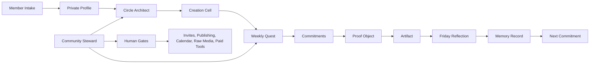
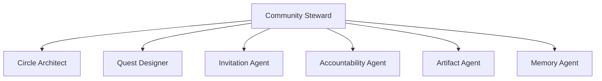

# Starlight Communities

[](https://github.com/frankxai/starlight-communities/actions/workflows/ci.yml)
[](LICENSE)
[](package.json)
[](tsconfig.json)

Agentic community infrastructure for people building freedom systems, mind systems, content, events, and intelligent lives.

Starlight Communities turns a community from a passive chat room into a weekly creation-cell operating system:

```text
3-5 people -> weekly quest -> pair spark -> creation lab -> proof -> reflection -> next commitment
```

It gives community builders the thing most platforms do not: a repeatable system for helping members ship visible proof together.

## Why It Exists

Most communities optimize for posts, messages, and events. Starlight Communities optimizes for identity, progress, recognition, belonging, and proof.

The core bet:

> The weekly ritual and member memory are the product. Circle, Discord, Slack, email, and web apps are surfaces.

## What You Can Build

- A 5-15 person concierge pilot.
- A creator cohort with weekly artifacts.
- A founder circle that ships proof every Friday.
- A private mastermind with memory and safety gates.
- A Circle, Discord, Slack, or native web community that keeps SIS-style memory as canonical.
- A Railway-hosted API for run sheets and community blueprints.
- A Codex plugin for agentic community design and operations.

## System Map



## Agent Team



| Agent | Job | Human Gate |
|---|---|---|
| Community Steward | Weekly cadence, synthesis, escalation | External action approval |
| Circle Architect | 3-5 person cell matching | Sensitive match review |
| Quest Designer | Weekly quests and prompts | Professional advice block |
| Invitation Agent | Invite and follow-up drafts | Send approval |
| Accountability Agent | Proof, blockers, next moves | Distress escalation |
| Artifact Agent | Posts, docs, maps, prompts, event plans | Publish approval |
| Memory Agent | Profile deltas and memory records | Raw media consent |

## Quick Start

```bash
pnpm install
pnpm validate
pnpm smoke:cli
```

Generate a run sheet:

```bash
pnpm start -- run-sheet examples/pilot-week.json
```

Run the local API:

```bash
pnpm dev
curl http://localhost:3000/health
```

Generate over HTTP:

```bash
curl -X POST http://localhost:3000/v1/run-sheet \
  -H "content-type: application/json" \
  --data @examples/pilot-week.json
```

## API

| Route | Method | Purpose |
|---|---|---|
| `/health` | `GET` | Service health check |
| `/v1/run-sheet` | `POST` | Generate weekly cells, quests, commitments, gates, memory records |
| `/v1/blueprint` | `POST` | Generate a community strategy blueprint |

Blueprint example:

```json
{
  "name": "Visible Proof Guild",
  "audience": "AI-native creators",
  "member_promise": "Ship one proof object per week with a small cell.",
  "value_pillar": "engagement",
  "primary_surface": "railway_api",
  "pilot": {
    "week_id": "2026-W27",
    "theme": "visible proof",
    "challenge_type": "ai_companion",
    "members": []
  }
}
```

## Deployment

Local:

```bash
pnpm build
pnpm serve
```

Railway:

```bash
railway up
```

The repo includes:

- `Dockerfile`
- `railway.json`
- `/health` health check
- `PORT` and `HOST` env support

No secrets are required for the core API. Platform adapters should add dry-run mode and explicit human approval before sends, publishing, calendar actions, or paid-service activation.

## Codex Plugin

This repo includes a repo-local Codex plugin:

```text
plugins/starlight-communities/
```

It contains:

- `.codex-plugin/plugin.json`
- `$starlight-communities-builder`
- strategy, architecture, and workflow references
- a deterministic community-plan scorer
- visual plugin assets

The plugin is listed in:

```text
.agents/plugins/marketplace.json
```

## OpenClaw And Hermes

OpenClaw templates:

```text
openclaw/REGISTRY.md
openclaw/agents/*/SOUL.md
```

Hermes routing:

```text
hermes/CLAW.md
hermes/profiles/*.yaml
hermes/workflows/*.yaml
```

These are intentionally permission-scoped. They are contracts for bounded agents, not unchecked automation.

## Repository Map

| Path | Purpose |
|---|---|
| `src/` | TypeScript schemas, matching, gates, strategy, server, CLI |
| `test/` | Vitest coverage for schemas, gates, matching, strategy, server |
| `skills/` | Public-safe Agent Skills for the seven community agents |
| `plugins/` | Codex plugin and `$starlight-communities-builder` skill |
| `openclaw/` | SOUL templates and registry posture |
| `hermes/` | Claw, profiles, workflows |
| `modules/` | Machine-readable module manifest |
| `docs/` | Architecture, API, deployment, strategy, security, roadmap |
| `examples/` | Synthetic pilot data only |

## Design Principles

1. Member promise before platform.
2. Cells before channels.
3. Quests, not homework.
4. Proof over posting.
5. Helpful recognition, never shame.
6. Agent drafts, human approves.
7. Private by default.
8. Platforms are adapters.
9. Metrics follow strategy.
10. Every week creates memory.

## Inspired By

- Community Canvas: identity, experience, structure.
- CMX SPACES: map community work to a primary value pillar.
- Orbit-style member journey thinking: visitors become members, contributors, hosts, and alumni.
- GitHub README guidance: explain why useful, what it does, and how to use it.
- Awesome Agent Skills, OpenClaw, Hermes Agent, and skill best-practice repositories.

Research notes live in [docs/research-ledger.md](docs/research-ledger.md).

## Public Safety

Do not commit:

- real member profiles;
- contact lists;
- raw voice or video;
- private reflections;
- private matching rationale;
- API keys, tokens, cookies, `.env` files, or provider secrets.

## Status

This is a production-grade starter system: deterministic core, API runtime, tests, CI, plugin, agent templates, and deployment scaffolding. It is not yet a hosted SaaS or a live community platform.

Next build: a human-gated pilot dashboard or a dry-run platform adapter.
