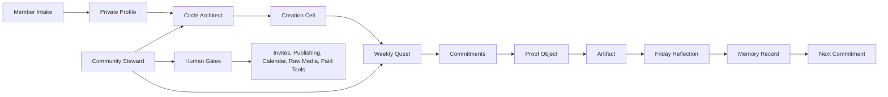
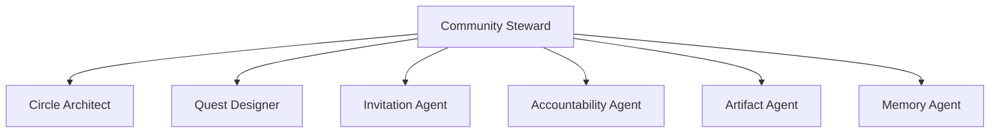

# Starlight Communities

[](https://github.com/frankxai/starlight-communities/actions/workflows/ci.yml)
[](LICENSE)
[](package.json)
[](tsconfig.json)

A public-safe operating kit for community stewards who want small groups to create together every week.

Starlight Communities replaces passive chat-room activity with a repeatable creation-cell loop:

```text
3-5 people -> weekly quest -> pair spark -> creation lab -> proof -> reflection -> next commitment
```

It helps 3-5 people turn a shared intention into visible proof and a clear next commitment.

## Purpose

Most communities optimize for posts, messages, and events. Starlight Communities optimizes for identity, progress, recognition, belonging, and proof.

The core bet:

> The weekly ritual and member memory are the product. Circle, Discord, Slack, email, and web apps are surfaces.

The project is deliberately platform-agnostic. It provides the ritual, contracts, safety boundaries, and deterministic tooling; community platforms remain optional delivery adapters.

## How People Experience It

A creation cell begins the week with one quest and a small commitment. Members use a short pair conversation to name likely blockers, meet for a focused creation lab, submit a proof object, and close the week with a reflection that becomes the next commitment. The useful outcome is not more messages: it is one visible artifact and one remembered next move.

The fastest way to evaluate the system is to run the [concierge pilot kit](docs/pilot-kit.md) with 5-15 people before building an integration. It includes the intake questions, first-week quest, pair-spark agenda, Friday reflection, and a measurable week-one success criterion.

Agents may draft run sheets, matches, prompts, follow-ups, artifacts, and memory deltas. Humans approve sensitive matching, external sends, publishing, calendar events, raw-media handling, and paid services.

## What You Can Build

- A 5-15 person concierge pilot.
- A creator cohort with weekly artifacts.
- A founder circle that ships proof every Friday.
- A private mastermind with memory and safety gates.
- A Circle, Discord, Slack, or native web community that keeps SIS-style memory as canonical.
- A Railway-hosted API for run sheets and community blueprints.
- A Codex plugin for agentic community design and operations.

## System Map


```mermaid
flowchart LR
  A[Member Intake] --> B[Private Profile]
  B --> C[Circle Architect]
  C --> D[Creation Cell]
  D --> E[Weekly Quest]
  E --> F[Commitments]
  F --> G[Proof Object]
  G --> H[Artifact]
  H --> I[Friday Reflection]
  I --> J[Memory Record]
  J --> K[Next Commitment]

  S[Community Steward] --> C
  S --> E
  S --> L[Human Gates]
  L --> M[Invites, Publishing, Calendar, Raw Media, Paid Tools]
```

## How Agents Explore It

Agents should start with [`AGENTS.md`](AGENTS.md), then read the repository contracts in [`SYSTEM.md`](SYSTEM.md), [`SCHEMA.md`](SCHEMA.md), and [`SKILLS.md`](SKILLS.md). From there:

1. Inspect `src/` and `test/` for the deterministic TypeScript core and its verification boundary.
2. Use `skills/` for the seven permission-scoped community roles.
3. Use `plugins/` for the repo-local Codex plugin and builder workflow.
4. Use `openclaw/` and `hermes/` as bounded routing templates, not autonomous authority.
5. Use only synthetic examples, preserve human approval gates, and run `pnpm validate` when dependencies are already installed.

SIS-style memory is canonical. Circle, Discord, Slack, email, web apps, OpenClaw, Hermes, and Railway are surfaces or adapters; none should become an unreviewed source of truth.

## Agent Team


```mermaid
flowchart TB
  Steward[Community Steward]
  Steward --> Architect[Circle Architect]
  Steward --> Quest[Quest Designer]
  Steward --> Invite[Invitation Agent]
  Steward --> Accountability[Accountability Agent]
  Steward --> Artifact[Artifact Agent]
  Steward --> Memory[Memory Agent]
```

| Agent | Job | Human Gate |
|---|---|---|
| Community Steward | Weekly cadence, synthesis, escalation | External action approval |
| Circle Architect | 3-5 person cell matching | Sensitive match review |
| Quest Designer | Weekly quests and prompts | Professional advice block |
| Invitation Agent | Invite and follow-up drafts | Send approval |
| Accountability Agent | Proof, blockers, next moves | Distress escalation |
| Artifact Agent | Posts, docs, maps, prompts, event plans | Publish approval |
| Memory Agent | Profile deltas and memory records | Raw media consent |

## Quick Start

For a human-first trial, start with [`docs/pilot-kit.md`](docs/pilot-kit.md). For the deterministic CLI and API:

```bash
pnpm install
pnpm validate
pnpm smoke:cli
```

Generate a run sheet:

```bash
pnpm start -- run-sheet examples/pilot-week.json
```

Run the local API:

```bash
pnpm dev
curl http://localhost:3000/health
```

Generate over HTTP:

```bash
curl -X POST http://localhost:3000/v1/run-sheet \
  -H "content-type: application/json" \
  --data @examples/pilot-week.json
```

## API

| Route | Method | Purpose |
|---|---|---|
| `/health` | `GET` | Service health check |
| `/v1/run-sheet` | `POST` | Generate weekly cells, quests, commitments, gates, memory records |
| `/v1/blueprint` | `POST` | Generate a community strategy blueprint |

Blueprint example:

```json
{
  "name": "Visible Proof Guild",
  "audience": "AI-native creators",
  "member_promise": "Ship one proof object per week with a small cell.",
  "value_pillar": "engagement",
  "primary_surface": "railway_api",
  "pilot": {
    "week_id": "2026-W27",
    "theme": "visible proof",
    "challenge_type": "ai_companion",
    "members": []
  }
}
```

## Deployment

Local:

```bash
pnpm build
pnpm serve
```

Railway:

```bash
railway up
```

The repo includes:

- `Dockerfile`
- `railway.json`
- `/health` health check
- `PORT` and `HOST` env support

No secrets are required for the core API. Platform adapters should add dry-run mode and explicit human approval before sends, publishing, calendar actions, or paid-service activation.

## Codex Plugin

This repo includes a repo-local Codex plugin:

```text
plugins/starlight-communities/
```

It contains:

- `.codex-plugin/plugin.json`
- `$starlight-communities-builder`
- strategy, architecture, and workflow references
- a deterministic community-plan scorer
- visual plugin assets

The plugin is listed in:

```text
.agents/plugins/marketplace.json
```

## OpenClaw And Hermes

OpenClaw templates:

```text
openclaw/REGISTRY.md
openclaw/agents/*/SOUL.md
```

Hermes routing:

```text
hermes/CLAW.md
hermes/profiles/*.yaml
hermes/workflows/*.yaml
```

These are intentionally permission-scoped. They are contracts for bounded agents, not unchecked automation.

## Usefulness

**Usable today:** a concierge pilot kit, deterministic creation-cell and run-sheet logic, synthetic examples, schemas, tests, a CLI and HTTP API, seven agent skills, a Codex plugin, and bounded OpenClaw/Hermes templates.

**Deliberately not included yet:** a hosted SaaS, a live member-facing dashboard, production authentication or multi-tenancy, and live platform adapters. Adopters remain responsible for platform hardening, consent, identity, operations, and every external-action approval boundary.

Clone this repo when you want to run or adapt one human-gated creation week. Wait for a hosted product if you need a turnkey community platform rather than an operating-system starter.

## Repository Map

| Path | Purpose |
|---|---|
| `src/` | TypeScript schemas, matching, gates, strategy, server, CLI |
| `test/` | Vitest coverage for schemas, gates, matching, strategy, server |
| `skills/` | Public-safe Agent Skills for the seven community agents |
| `plugins/` | Codex plugin and `$starlight-communities-builder` skill |
| `openclaw/` | SOUL templates and registry posture |
| `hermes/` | Claw, profiles, workflows |
| `modules/` | Machine-readable module manifest |
| `docs/` | Architecture, API, deployment, strategy, security, roadmap |
| `examples/` | Synthetic pilot data only |
| `SYSTEM.md`, `SCHEMA.md`, `SKILLS.md` | Agent-readable system, contract, and routing indexes |
| `PRODUCT.md`, `GTM.md` | Product role, outcome, adoption, and evidence-led GTM boundaries |
| `RUNBOOK.md`, `TESTING.md`, `SECURITY.md` | Operations, verification, and public-safety guidance |
| `llms.txt` | Compact discovery map for AI tools |

## Design Principles

1. Member promise before platform.
2. Cells before channels.
3. Quests, not homework.
4. Proof over posting.
5. Helpful recognition, never shame.
6. Agent drafts, human approves.
7. Private by default.
8. Platforms are adapters.
9. Metrics follow strategy.
10. Every week creates memory.

## Inspired By

- Community Canvas: identity, experience, structure.
- CMX SPACES: map community work to a primary value pillar.
- Orbit-style member journey thinking: visitors become members, contributors, hosts, and alumni.
- GitHub README guidance: explain why useful, what it does, and how to use it.
- Awesome Agent Skills, OpenClaw, Hermes Agent, and skill best-practice repositories.

Research notes live in [docs/research-ledger.md](docs/research-ledger.md).

## Public Safety

Do not commit:

- real member profiles;
- contact lists;
- raw voice or video;
- private reflections;
- private matching rationale;
- API keys, tokens, cookies, `.env` files, or provider secrets.

## Status

This is a deterministic, tested starter system with an API runtime, CI, plugin, agent templates, and deployment scaffolding. It is not a hosted SaaS or a live community platform.

Known limits: there is no production authentication or multi-tenancy, live adapters are not enabled by default, examples must remain synthetic, and external actions always require human approval. See the [roadmap](docs/roadmap.md) for the next bounded build: a human-gated pilot dashboard or a dry-run platform adapter.

## Host programme planning

The local `assess-programme` CLI checks synthetic venue/programme economics, capacity,
responsibilities and media-review inputs. It never books, sends or verifies contracts.
See [architecture and usage](docs/host-programme-architecture.md). The complementary
Codex skill is `host-programme-operations` in the existing repository plugin.
